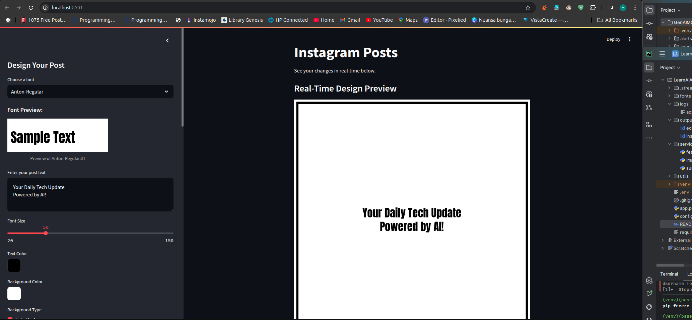
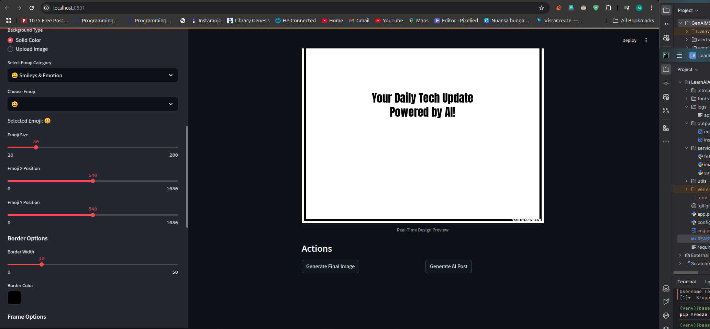

# AI Agents vs. Code Pipelines

This document explains the difference between AI agents and regular code-based solutions. It also demonstrates how to evolve a specific project (e.g., resume analysis using AI models) into an intelligent AI agent.

---

## **What Are AI Agents?**

AI agents are software systems designed to:

1. **Perceive** their environment (e.g., input data, user queries, external systems).
2. **Decide** autonomously what actions to take using reasoning or learned knowledge.
3. **Act** to achieve specific goals (e.g., solve problems, answer queries, or perform tasks interactively).
4. **Adapt** based on feedback or changing conditions.

Key features of AI agents:
- Dynamic decision-making.
- Goal-oriented behavior.
- Memory or state-tracking capabilities.
- Integration of multiple tools and workflows.

---

## **Difference Between AI Agents and Regular Code Pipelines**

| **Aspect**              | **Code Pipelines (e.g., Resume Analysis Project)** | **AI Agents**                                                                                      |
|-------------------------|-----------------------------------------------------|----------------------------------------------------------------------------------------------------|
| **Autonomy**            | Executes predefined tasks when triggered.           | Operates autonomously, deciding what steps to take to achieve a broader goal.                     |
| **Reasoning**           | No reasoning; tasks are hard-coded into the logic.  | Performs reasoning to handle unstructured tasks or unexpected input (e.g., chain-of-thought reasoning). |
| **Goal-Oriented**       | Focuses only on a single task pipeline.             | Works toward a high-level goal that might involve multiple dynamic tasks.                          |
| **Adaptability**        | Cannot adapt beyond what is programmed.             | Can adapt behavior or task sequence based on feedback, memory, or external tools.                 |
| **Tools Integration**   | Uses specific pre-trained models for static tasks.  | Can integrate multiple tools (e.g., models, APIs, databases) dynamically for varied goals.        |

---

## **Evolving the Resume Analysis Project Into an AI Agent**

The existing project involves using **facebook/bart-large-cnn** (summarization) and **distilbert-base-uncased-distilled-squad** (Q&A). While effective, this setup is a **code pipeline** because:
- The scope is predefined (summarization and Q&A tasks only).
- It lacks autonomy and reasoning.
- It cannot dynamically decide or adapt beyond the coded tasks.

To evolve it into an AI agent:
1. **Introduce Goal-Oriented Behavior**: Allow the system to handle broader tasks dynamically (e.g., "Help the user analyze resumes for job fit").
2. **Integrate Multiple Tools**: Combine summarization, Q&A, and other capabilities (e.g., job matching, sentiment analysis).
3. **Add Reasoning**: Use frameworks like **LangChain** to orchestrate tasks dynamically.
4. **Enable Interaction**: Allow follow-up questions with memory and context awareness.
5. **Use State/Memory**: Track conversation history for context-aware responses.

---

## **Implementation Examples**

### **Existing Code Pipeline**
This code summarizes a resume and answers specific questions.

```python
from transformers import pipeline

# Summarize resume
summarizer = pipeline("summarization", model="facebook/bart-large-cnn")
summary = summarizer(resume_text, max_length=130, min_length=30, do_sample=False)

# Answer a question
qa_pipeline = pipeline("question-answering", model="distilbert-base-uncased-distilled-squad")
response = qa_pipeline(question="What is the candidate's expertise?", context=resume_text)
```

### **Enhanced AI Agent Code**
This implementation turns the project into an AI agent using **LangChain** for dynamic reasoning and tool integration.

```python
from langchain.agents import initialize_agent, Tool
from langchain.prompts import PromptTemplate
from langchain.llms import HuggingFacePipeline
from transformers import pipeline

# Define tools
summarizer_pipeline = pipeline("summarization", model="facebook/bart-large-cnn")
qa_pipeline = pipeline("question-answering", model="distilbert-base-uncased-distilled-squad")

def summarize_resume(resume_text):
    return summarizer_pipeline(resume_text, max_length=130, min_length=30, do_sample=False)

def answer_question(question, context):
    return qa_pipeline(question=question, context=context)

tools = [
    Tool(name="Summarizer", func=summarize_resume, description="Summarizes resumes."),
    Tool(name="Q&A", func=answer_question, description="Answers questions about resumes.")
]

# Create agent
llm = HuggingFacePipeline(pipeline="text-davinci-003")  # Use a local model
agent = initialize_agent(tools, llm, agent="zero-shot-react-description", verbose=True)

# Example input
response = agent.run("Summarize this resume and tell me if the candidate is a good fit for a software developer role.")
print(response)
```

---

## **When to Use AI Agents vs. Code Pipelines**

- **Code Pipelines**: Use for static, well-defined tasks like resume analysis with specific input/output requirements.
- **AI Agents**: Use for dynamic, multi-step, goal-driven applications requiring reasoning, adaptability, or interaction.

---

By evolving your project into an AI agent, you can make it more interactive, flexible, and capable of handling complex workflows dynamically!

# Project Structure : For now we built Generating Instagram Post Using Free Models
## later we make it with agents

## Project Images



